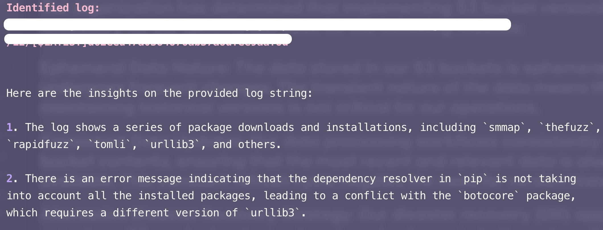

<h1 align="center">
  <br>
  
  <br>
  Cloudwatch GenAI Insights CLI
  <br>
</h1>

<h4 align="center">This cli provides AI-powered insights for CloudWatch logs using Amazon Bedrock and Claude 3 Haiku. It gets the most recent log stream for a specified CloudWatch log group and generates an analysis using generative AI.
</h4>

<p align="center">
  <a href="#features">Features</a> •
  <a href="#how-it-works">How it works</a> •
  <a href="#prerequisites">Prereq</a> •
  <a href="#install">Install</a> •
  <a href="#usage">Usage</a> •
  <a href="#example">Example</a> •
</p>

### Features

- ☁️ get most recent log stream from a CloudWatch log group
- 🤖 Analyzes log events using Amazon Bedrock and Claude 3 Haiku
- 📖 Provide AI-generated insights in plain text format

### How it works

1. CLI uses boto3 to interact with AWS CloudWatch Logs and Amazon Bedrock.
2. It gets the most recent log stream in a log group.
3. It gets the latest 50 log events from the stream.
4. Log events are sent to Amazon Bedrock, using the Claude 3 Haiku model for analysis.
5. AI-generated insights are formatted and displayed to the user.

### Prerequisites

- Python 3.7+
- AWS credentials configured (either through environment variables, AWS CLI, or IAM role)
- `anthropic.claude-3-haiku-20240307-v1:0` model enabled in Amazon Bedrock.

### Install

```bash
pip install https://github.com/rowlinsonmike/cwai/raw/main/dist/cwai-0.1.0.tar.gz
```

### Usage

The CLI provides one main commands:

1. `inspect`: analyzes logs from a specified CloudWatch log group

   ```
   cwai inspect <log-group-arn>
   ```

   Replace `<log-group-arn>` with the ARN of your CloudWatch log group.

### Example

<h1 align="center">
  
  <br>
</h1>

```
cwai inspect arn:aws:logs:us-west-2:123456789012:log-group:/aws/lambda/my-function
```

This command will:

1. Fetch the most recent log stream from the specified log group
2. Retrieve the latest 50 log events
3. Send the log events to Amazon Bedrock for analysis
4. Display the AI-generated insights
